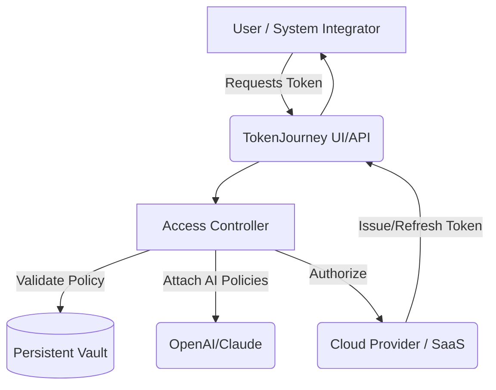

# 🎟️ TokenJourney: Token Management Suite

🔗 **Download the latest package to empower your authentication pipeline:**

---

Tokens are the new passports in the digital realm. **TokenJourney** is a powerful, modular platform for managing secure authentication tokens and secrets across cloud-native applications. Inspired by "tokensa," this suite harnesses modern APIs, provides zero-downtime rolling upgrades, and includes multi-layered access control, analytics, and provider integrations—not only for developers but also for automation engineers and compliance officers.

## 📖 Table of Contents
- [Overview](#-overview)
- [Mermaid Diagram](#-architecture-overview)
- [Feature List](#-features)
- [Example Profile Configuration](#-example-profile-configuration)
- [Example Console Invocation](#-example-console-invocation)
- [OpenAI & Claude API Integration](#-ai-powered-apis-integration)
- [Responsive UI & 24/7 Support](#-user-experience-specialties)
- [🌐 Multilingual Support](#-multilingual-support)
- [Platform Compatibility](#-os-compatibility)
- [SEO-Driven Innovation](#-seo-optimized-features)
- [Disclaimer](#-disclaimer)
- [License](#-license)
- [Download](#-one-more-step)
  
---

## 🌟 Overview

**TokenJourney** is designed for teams who seek full control over token lifecycles, including issuance, rotation, auditing, and revocation, all while supporting a global, multi-cloud infrastructure. Built using battle-tested patterns, TokenJourney integrates seamlessly with OpenAI, Claude, and custom endpoints, turning your authentication pipeline into a resilient, intelligent machine.

Imagine a conductor seamlessly orchestrating token hand-offs across continents and compliance regimes—**TokenJourney** is that conductor.

---

## 🔷 Architecture Overview

Visualize the big picture with this flow:

---

## 🛠️ Features

- 🎯 **Centralized Token Management**: Coordinate secrets for dozens of projects from a single pane of glass.
- 🔐 **Granular Access Policies**: Assign access at user, group, or machine identity level.
- 🍃 **OpenAI & Claude Compliance Adapters**: Enforce token rules through dynamic AI-powered governance.
- 🇺🇳 **Multilingual Support**: Frontend and CLI are ready in English, Español, 中文, العربية, français, Deutsch.
- ⏩ **24/7 Smart Customer Support**: Live help and AI chatbots answer your every question.
- 💎 **Responsive, Themed UI**: Retina-ready, dark/light modes, keyboard shortcuts, mobile-first.
- 🚦 **Real-time Auditing**: View token utilization, expiry forecasts, anomaly detection.
- 🔄 **Zero-Downtime Rotation**: No loss of service when rolling new credentials.
- 🎛️ **Seamless Cloud Integration**: Out-of-the-box support for AWS, Azure, GCP, and private vaults.
- 🛡️ **End-to-end Encryption**: Local and in-transit, never see secrets in plain text.
- 📈 **SEO-Optimized Console Analytics**: Monitor token lifecycle events for better search discoverability.
- ⚡ **Pluggable Extensions**: Write custom flows, add cloud adapters, or automate key rollovers.

---

## 📝 Example Profile Configuration

Enable strict workspace control with YAML proficiency:

    profile: deployment_europe
    region: eu-central-1
    providers:
      - name: aws
        enabled: true
        role: arn:aws:iam::1234567890:role/token-issuance
      - name: openai
        enabled: true
        api_key: prompt-XX-xxxxxx
    lifecycle:
      rotate_every: 30d
      ai_audit: true
    access_policies:
      - path: /production/*
        actors: [engineers, bots]
        max_age: 7d
    ui:
      language: deutsch
      theme: dark

---

## 🖥️ Example Console Invocation

Typical token issuance—locally or automated:

    $ tokenjourney issue --profile deployment_europe --provider openai --output yaml
    Token: 58fd6e12-xxxx-xxxx-ex
    Provider: OpenAI
    Expires: 2026-08-31T12:23:11Z
    AuditTrail: Enabled

Rotate all secrets for all live environments in one fell swoop:

    $ tokenjourney rotate --all --notify admin --ai-audit

Query centralized logs with SEO-friendly details in output:

    $ tokenjourney audit --last 100 | grep 'anomaly'

---

## 🤖 AI-Powered APIs Integration

TokenJourney acts as a nexus for developer and AI-first teams. Integrate **OpenAI** (GPT-4/5) or **Claude** by setting API keys via the secure console or environment secrets.

Features:
- Dynamically adapt access based on NLP scans of request contexts
- Token usage forecasting and anomaly alerts delivered via AI bots
- Granular role definitions and recommendation systems

Sample configuration within your project settings enables instant AI-powered compliance—no need to write custom adapters.

---

## 💬 User Experience Specialties

Take comfort in our always-on customer support platform:
- 🌏 Social customer care: in-app chat, Slack/Teams integrations, 24/7 email response.
- ⚡ Instant answers: Searchable docs and real-time bot support inside the UI and CLI.
- 📱 Adaptive UI: Looks stunning on mobile, web, or even terminals with solarized colors.
- 🧭 Accessibility first: Screen-reader friendly.

---

## 🌐 Multilingual Support

**TokenJourney**'s interface ships with instant translations. Empower global teams with native input/output. Switch via CLI flag or console toggle.

Supported languages:  
🇬🇧 English | 🇪🇸 Español | 🇨🇳 中文 | 🇦🇪 العربية | 🇫🇷 Français | 🇩🇪 Deutsch

---

## 🧩 OS Compatibility

|  | Windows | Linux | macOS | BSD | Web |
|---|:---:|:---:|:---:|:---:|:---:|
| 🎟️ TokenJourney UI | ✅ | ✅ | ✅ | ⚠️ | ✅ |
| 🚀 CLI Utility      | ✅ | ✅ | ✅ | ✅ | ❌ |

---

## 📈 SEO-Optimized Features

To drive discoverability, every token event, audit, or incident generates structured logs and indexed pages. Integration with site maps, OpenGraph, and JSON-LD for modern web standards. Empower your site/app to rank for key terms like "cloud token management", "secure API secret rotation", and "enterprise OAuth orchestration".

---

## ⚠️ Disclaimer

*TokenJourney is designed for development, staging, and production infrastructures. Due diligence and security reviews are recommended before rolling out into sensitive or compliance-heavy environments. No warranty is expressed or implied; 2026 and beyond demands that security be a shared journey.*

---

## 📜 License

Code, documentation, and logic are available under the [MIT license](https://opensource.org/licenses/MIT).  
© 2026 TokenJourney Collaborators

---

## 🔗 One More Step: Download

Are you ready to orchestrate tokens with a symphony of security, AI, and automation?

**Shape the future of authentication—become part of TokenJourney.**